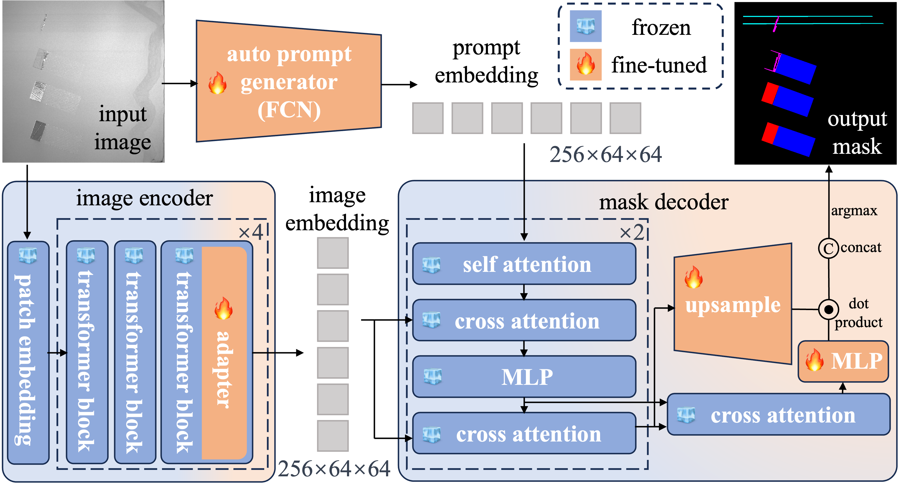

# SAAM: Segment Anything Model for layer-wise defect detection in Laser Powder Bed Fusion 

## Abstract

To apply large vision model in the field of LPBF layer-wise defect detection, we designed a powder spreading defect segmentation model based on SAM (Segment Anything Model), which is capable of automatically generating prompts and outputting semantic category information.



## Dataset

Comming soon.

## Documentation

* Install

Clone repo and install requirements.txt in a Python>=3.9.0 environment.

```sh
git clone https://github.com/aaahqiu/SAAM.git
cd SAAM
pip install -r requirements.txt
```

* Training

Open **train.py** and edit the args. Train the model with:

```sh
python train.py
```

* Inference

Inference using your model with **test.py**.

```sh
python test.py
```

## Citation

```tex
@article{tan2024Powder,
  title={Powder-Spreading Defect Detection in Laser Powder Bed Fusion Based on Large Vision Model},
  author={Tan, Kunpeng and Tang, Jiafeng and Zhao, Zhibin and Wang, Chenxi and Zhang, Xingwu and He, Weifeng and Chen, Xuefeng},
  journal={Chinese Journal of Lasers},
  volume={51},
  number={10},
  pages={1002319--1002319},
  year={2024},
  publisher={中国激光杂志社}
}
```

